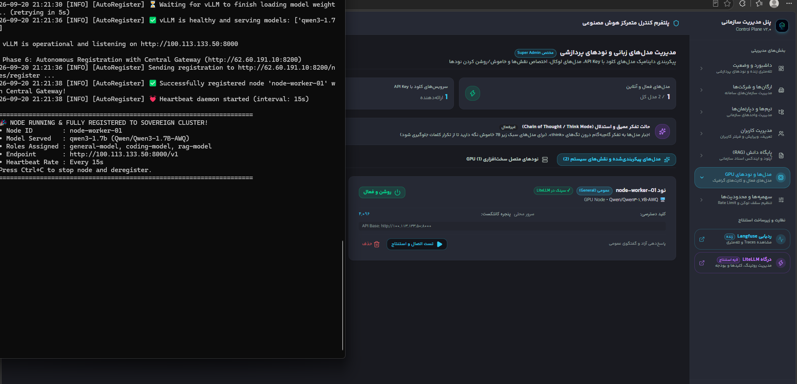

# Sovereign AI Node Agent

[](https://www.python.org/downloads/)
[](https://github.com/vllm-project/vllm)
[](https://www.ray.io/)
[](LICENSE)
[](SECURITY.md)
[](CODE_OF_CONDUCT.md)

Sovereign AI Node Agent is an autonomous, high-throughput distributed inference engine for self-hosted LLM deployments. Built for heterogeneous on-premise infrastructure, it benchmarks local GPU silicon, detects local offline model weights and Docker archives, initializes optimized vLLM runtimes, and seamlessly registers itself with the Central Control Plane over a secure zero-trust WireGuard mesh.

The repository contains the autonomous lifecycle orchestrator, hardware diagnostic fallbacks, local-first image discovery, model catalog recommendations, and Ray multi-node clustering scripts.



---

## Table of Contents

- [Core Capabilities](#core-capabilities)
  - [1. 4-Tier Hardware Diagnostics](#1-4-tier-hardware-diagnostics)
  - [2. Benchmark-Driven Model Selection](#2-benchmark-driven-model-selection)
  - [3. Local-First Air-Gap Discovery](#3-local-first-air-gap-discovery)
  - [4. High-Throughput vLLM Runtime](#4-high-throughput-vllm-runtime)
  - [5. Autonomous Mesh Registration & Heartbeats](#5-autonomous-mesh-registration--heartbeats)
- [Distributed Inference with Ray](#distributed-inference-with-ray)
  - [Tensor Parallelism (Intra-Node)](#tensor-parallelism-intra-node)
  - [Pipeline Parallelism (Inter-Node)](#pipeline-parallelism-inter-node)
- [Requirements](#requirements)
- [Configuration](#configuration)
- [Quick Start](#quick-start)
- [Interactive Node Lifecycle](#interactive-node-lifecycle)
- [Project Structure](#project-structure)
- [Governance](#governance)
- [License](#license)

---

## Core Capabilities

### 1. 4-Tier Hardware Diagnostics
To guarantee reliable initialization across Linux servers, consumer workstations, and Windows/WSL2 development environments without crashing, the node executes a resilient 4-tier discovery cascade:
1. **Tier 1 (NVIDIA NVML):** High-precision programmatic querying of VRAM, GPU architecture, and driver capabilities via native C bindings.
2. **Tier 2 (`nvidia-smi` CLI):** Subprocess fallback parsing formatted XML/CSV output if NVML bindings are restricted.
3. **Tier 3 (PyTorch CUDA Runtime):** Direct GPU probe through PyTorch tensor device interfaces.
4. **Tier 4 (Windows WMI):** Fallback operating system device query to detect physical graphics hardware in headless Windows environments.

### 2. Benchmark-Driven Model Selection
Upon evaluating total available VRAM and system memory, the agent references `model_catalog.json` to compute the **Top 3 Recommended Models** tailored to the silicon:
- **AWQ / GPTQ 4-bit Quantization:** Maximizes token throughput and context length while reducing memory footprints by up to 70%.
- **VRAM Utilization Safety Guard:** Dynamically configures `gpu_memory_utilization` (default: `0.5` to `0.85`) to avoid Out-Of-Memory (OOM) driver crashes.

### 3. Local-First Air-Gap Discovery
Designed specifically for air-gapped environments where public HuggingFace downloads are blocked:
- **Docker Archive Extraction:** Automatically searches local root and parent directories for pre-packaged `vllm-image.tar` archives and loads them directly into Docker without internet access.
- **Offline Weight Scanning:** Recursively searches `./models`, `D:/models`, and local HuggingFace cache directories to detect existing weights before initiating any network download.

### 4. High-Throughput vLLM Runtime
The agent manages the vLLM engine lifecycle using state-of-the-art memory allocation:
- **PagedAttention:** Eliminates memory fragmentation by allocating KV-cache into discrete non-contiguous blocks, boosting concurrency up to 4x.
- **Continuous Batching:** Dynamically groups incoming requests at the token level rather than waiting for entire sequence completions.

### 5. Autonomous Mesh Registration & Heartbeats
Once the vLLM inference server is healthy:
- The agent queries Tailscale to obtain its private overlay IPv4 address.
- It initiates an encrypted handshake with the Central Control Plane at `http://<CENTRAL_IP>:8200`.
- It broadcasts periodic heartbeats containing real-time health metrics, active model tags, and available queue capacity.

---

## Distributed Inference with Ray

For models whose parameter count exceeds the VRAM of a single GPU, the agent integrates with **Ray** to enable multi-GPU and multi-node execution.

### Tensor Parallelism (Intra-Node)
When multiple GPUs exist on the same physical motherboard connected via high-speed PCIe or NVLink, Tensor Parallelism slices individual weight matrices horizontally and vertically:
```bash
python api_utils.py --model_tag Qwen/Qwen2.5-3B-Instruct-AWQ --tensor-parallel-size 2
```

### Pipeline Parallelism (Inter-Node)
When GPUs are distributed across physically separate servers connected via the Tailscale WireGuard mesh, Pipeline Parallelism partitions the transformer layers sequentially:

1. **On Machine A (Ray Head):**
   ```bash
   ray start --head --port=6379 --dashboard-host=0.0.0.0
   ```

2. **On Machine B (Ray Worker):**
   ```bash
   ray start --address='<MACHINE_A_TAILSCALE_IP>:6379'
   ```

3. **Launch Distributed vLLM:**
   ```bash
   python api_utils.py --model_tag Qwen/Qwen2.5-7B-Instruct --pipeline-parallel-size 2
   ```

---

## Requirements

- **Operating System:** Linux (Ubuntu 22.04 LTS recommended) or Windows 10/11 with WSL2
- **GPU:** NVIDIA GPU (Compute Capability 7.0+ recommended)
- **Drivers:** NVIDIA Driver 535+ and CUDA 12.1+
- **Python:** Python 3.10 or newer
- **Networking:** Tailscale client authenticated to the cluster mesh

---

## Configuration

Copy and configure the local environment file:

```bash
cp .env.example .env
```

```dotenv
# Central Control Plane Tailscale IP and Registry port
CENTRAL_GATEWAY_URL=http://100.115.80.12:8200
REGISTRY_SECRET_TOKEN=sk-sovereign-master-production-key

# Local Node Parameters
NODE_NAME=gpu-worker-node-01
VLLM_PORT=8000
GPU_MEMORY_UTILIZATION=0.5
MAX_MODEL_LEN=1024
MAX_NUM_SEQS=16
ENFORCE_EAGER=true
```

---

## Quick Start

### 1. Install Dependencies
```bash
git clone https://github.com/sovereign-ai-stack/ai-node-agent.git
cd ai-node-agent
pip install -r requirements.txt
```

### 2. Autonomous Launch
Run the all-in-one automation script:

```bash
# On Linux / WSL2:
python node_agent.py

# On Windows (native launcher):
run.bat
```

---

## Interactive Node Lifecycle

When executed, `node_agent.py` guides the operator through an autonomous 6-step initialization:

```text
[1/6] Scanning host silicon and CUDA devices...
      Detected: NVIDIA GeForce RTX 3060 (12 GB VRAM)
[2/6] Evaluating model compatibility from catalog...
      [1] Qwen/Qwen2.5-3B-Instruct-AWQ (Golden Choice - Optimal for 12GB)
      [2] deepseek-ai/DeepSeek-R1-Distill-Qwen-7B-AWQ
      [3] meta-llama/Llama-3.2-3B-Instruct
      Selection auto-fallback in 10s: #1 selected.
[3/6] Discovering local image archives...
      Found vllm-image.tar in workspace. Loaded into Docker daemon.
[4/6] Checking local weight directories...
      Found existing weights at ./models/Qwen2.5-3B-Instruct-AWQ.
[5/6] Starting vLLM runtime container with PagedAttention...
      vLLM healthy on port 8000.
[6/6] Connecting to Central Control Plane via Tailscale...
      Handshake verified. Node registered as healthy worker.
```

---

## Project Structure

```text
ai-node-agent/
├── node_agent.py           # Master autonomous node runner and interactive CLI
├── auto_register.py        # Central Control Plane handshake and heartbeat agent
├── hardware_detector.py    # 4-tier hardware diagnostic engine (NVML, SMI, PyTorch, WMI)
├── vllm_manager.py         # vLLM container supervisor and health checker
├── download_models.py      # Offline/online model weights synchronization
├── model_catalog.json      # Curated benchmark metadata and VRAM requirements
├── run.sh                  # Shell execution wrapper for Linux
├── run.bat                 # Batch execution wrapper for Windows
├── requirements.txt        # Python dependency manifest
└── assets/                 # Architecture diagrams and registration telemetry
```

---

## Governance

- Review our [Code of Conduct](CODE_OF_CONDUCT.md) for community participation standards.
- Check the [Contributing Guide](CONTRIBUTING.md) before submitting patches or feature requests.
- Read our [Security Policy](SECURITY.md) for responsible vulnerability disclosure.

---

## License

Distributed under the [MIT License](LICENSE).
